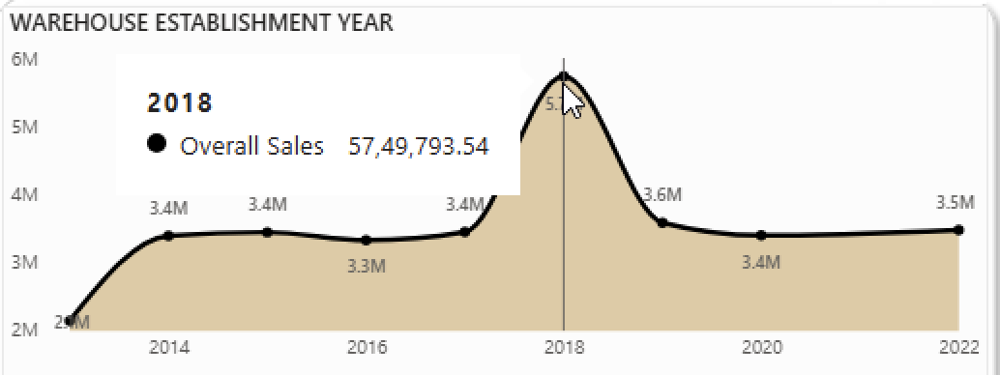

# Amazon Prime Day 2025: Sales Analysis & Business Storytelling

## Executive Summary: A Tale of Two Customers

The Amazon Prime Day 2025 sale generated **₹3.19 Crores** in total sales over 8000+ products. This success is powered by a dual-engine growth model, catering to two critical customer types: **volume-driven deal seekers** and **value-driven premium buyers**. Promotions drive traffic and sales volume, while high-value, full-priced items—especially in Electronics and Large Appliances—deliver substantial revenue per transaction.

---

## Dual-Engine Growth Model

### Engine #1: The Volume Driver (Discount Seekers)

- **Discounted products** account for **5,517 units sold** and **₹1.78 Crores** in revenue (More than 50% of total).
- **Business Impact:** Promotions capture price-sensitive customers and drive volume.
- **Customer Perception:** Discounts **do not reduce ratings**; both discounted and non-discounted items have an average rating of **~3.92**.

> **Recommendation:** Continue broad discount campaigns for volume; customer satisfaction remains unchanged, but can be improved. A further sentimental analysis on the reviews should be carried out to see where exactly the shortcomings are, and a possible outreach, coupled with stricter checks on the suppliers and third-party sellers should be in the cards.

### Engine #2: The Value Driver (Premium Buyers)

- **Non-discounted items:** Lower volume (**3,006 units**), but higher **average sale value (₹4,698)**.

- **Electronics:** Generates **₹1.51 Crores** sales; **average sale ₹12,277**.

- **Large Appliances:** **₹0.80 Crores** sales; **average sale ₹18,826**, top average rating (**3.98**).

> **Recommendation:** Avoid heavy discounting on premium products; offer value-adds like attractive EMI offers, warranties, installation, or bundles (wherever possible).

---

## Strategic Deep Dive & Actions

### 1. Geographic Targeting: Conquer the Urban Market

- **Urban sales:** Discounted items—**₹0.72 Crores**. Non-discounted items—**₹0.56 Crores**.
- **Customer Mix:** Urban shoppers buy both deals & premium goods.

> **Action:**  
> - Market discounts broadly in urban areas.  
> - Run targeted campaigns for luxury segments (social/email to premium buyers, as well as ramp up the app-based notifications generated for interested customers)

### 2. Logistics Optimization: Unlock Warehouse Potential

- **2018 Warehouses:** Peak year—**₹57.49 Lakhs**.

- **Warehouse Size:** Medium—**₹1.42 Cr**; Small—**₹1.1 Cr**; Large—**₹0.65 Cr** (underperformer).

- **Warehouse Type:** Mega FC—**₹2.06 Cr** sales; Average sale **₹3,687**.  
    Last-Mile Hub—**₹0.37 Cr** sales; Average sale **₹3,992**.

> **Actions:**
> - **Replicate Best Practices:** Analyze why 2018, medium-sized warehouses excel; adopt across all network.
> - **Audit Large Warehouses:** Investigate low sales, inventory, processes, and costs. Get in touch with Warehouse and Logistic Department.
> - **Optimize Inventory Strategy:** Stock discounted goods in Mega FCs, premium items in Last-Mile Hubs for fast, high-quality delivery of in-demand goods for optimum growth in sales and subsequent revenue.

NOTE: It is interesting to observe the discrepancy between the data for large warehouses being so low, yet the Mega FCs boasting the highest sales. This could lead to the conclusion that the Mega FC title is not just obtained based on size of an Amazon warehouse, but on other factors like location said warehouse caters to the most, its historical performance, constituent warehouse team, etc., in which case this would not qualify as a discrepancy at all, but if size is the only factor here, this could be pointing to a much bigger issue at hand, one of which is potentially a corrupted and/or mismatched data collection. A deeper dive is necessary to eliminate these questions before proceeding to making informed business decisions.

---
