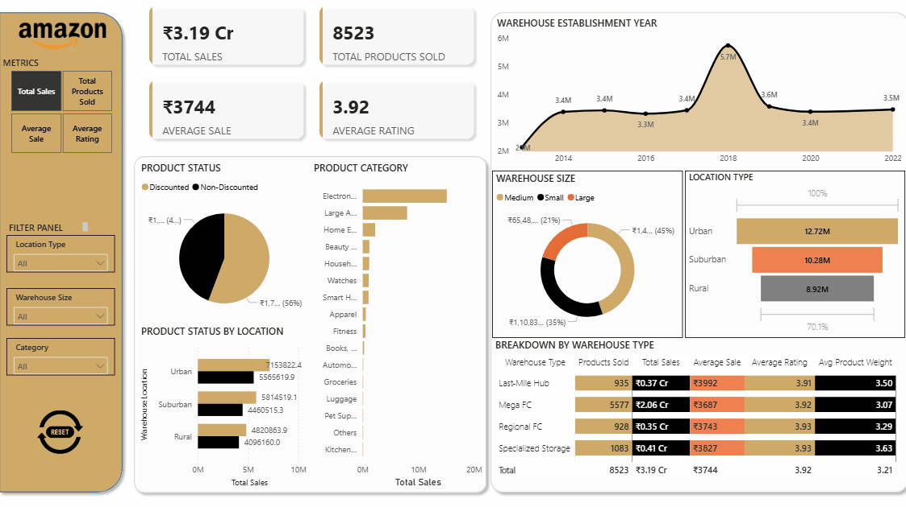

# Amazon Sales Analysis & Growth Strategy Dashboard

## Project Overview

This project presents an end-to-end data analytics solution designed to provide actionable insights into Amazon's sales performance. The primary objective is to analyze raw sales data, identify key performance indicators (KPIs), and present the findings through an interactive Power BI dashboard. The analysis delves into various dimensions, including product categories, warehouse logistics, and sales promotions, to uncover growth opportunities and inform strategic business decisions.

The project demonstrates a comprehensive skill set in data engineering, analysis, and visualization, showcasing proficiency in SQL for data cleaning and transformation, an additional Python (Pandas) for exploratory data analysis, and Power BI for creating a dynamic and insightful dashboard.

## Live Dashboard

(Given below is a gif to demonstrate the dynamic elements of the dashboard)

An interactive Power BI dashboard has been developed to allow for dynamic filtering and exploration of the sales data. The dashboard provides a high-level overview of key metrics and allows for granular analysis across different segments.



## Tech Stack & Tools

*   **Database:** MySQL
*   **Data Cleaning & Transformation:** SQL (also done in Pandas)
*   **Exploratory Data Analysis (EDA):** Python (Pandas, Matplotlib, Seaborn)
*   **Data Visualization & Dashboarding:** Power BI
*   **Version Control:** Git & GitHub

## Project Pipeline

This project follows a structured, multi-stage data pipeline:

1.  **Data Extraction:** The raw dataset, initially in a JSON format, was imported into a MySQL database.
2.  **Data Cleaning & Transformation (SQL):**
    *   Duplicate records were identified and handled.
    *   Data types were corrected (e.g., converting text to numeric types).
    *   Column names were standardized for clarity and ease of querying.
    *   Categorical data was cleaned and mapped to consistent values (e.g., 'no sale' updated to 'Non-Discounted').
3.  **Automated Data Pipeline (SQL Events):**
    *   A planned-out two-stage trigger system was implemented to create a real-time data pipeline:
        1.  **Purchase Event:** A trigger on the `Product_Tracker` database automatically inserts a new sales record into the main sales table when an item is marked as purchased.
        2.  **Dispatch Event:** A trigger on the `Warehouse_Inventory` database updates the sales record with warehouse and logistics details when the item is dispatched.
4.  **Analysis in Python:**
    *   The original data was imported from the MySQL database into a Pandas DataFrame. While a seemingly redundant step, this is done to showcase versatility in two different languages, and gives flexibility to anyone replicating this project to go with either an SQL approach or a Pandas one.
    *   EDA was performed to explore relationships between variables and generate initial visualizations using matplotlib and seaborn libraries.
5.  **Dashboarding in Power BI:**
    *   The final, cleaned dataset was exported and connected to Power BI.
    *   An interactive dashboard was built with key KPIs and filters for `Warehouse Location`, `Warehouse Size`, and `Category`.

## Data Source

The dataset used for this analysis is the "Amazon Sales Data" file, containing transactional records with details on product status, category, sales figures, ratings, and warehouse information.

## Setup & Installation

To replicate this project locally, please follow these steps:

1.  **Clone the repository:**
    ```
    git clone https://github.com/tanmaykumar99/Portfolio.amazon-sales-analysis.git
    ```
2.  **Database Setup:**
    *   Ensure you have MySQL Server installed.
    *   Create a new database and import the provided `Amazon-Sales-Data.sql` file to create the schema and load the data.
    *   Configure the database connection details in the Python script.
3.  **Python Environment:**
    *   It is recommended to use a virtual environment.
    *   Install the required libraries:
        ```
        pip install -r requirements.txt
        ```
4.  **Power BI:**
    *   Open the `.pbix` file in Power BI Desktop.
    *   You may need to update the data source settings to connect to your local MySQL database.

## Future Enhancements

*   **Predictive Modeling:** Develop a machine learning model to forecast future sales based on historical data and predictive features.
*   **Real-time Dashboard:** Enhance the automated data pipeline to feed into a real-time streaming dataset in Power BI for up-to-the-minute insights.
