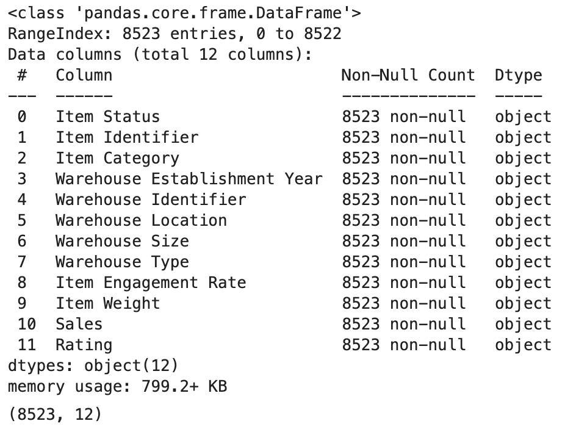

# Amazon Sales Cleaning & Exploratory Data Analysis (EDA) in Python

## Overview

This repository contains a Jupyter Notebook (`sales_analysis_pandas.ipynb`) dedicated to the cleaning and EDA of the raw Amazon sales data, extracted from MYSQL database. The primary goal of this analysis is to uncover initial patterns, validate hypotheses, and generate preliminary visualizations that inform the final strategic insights presented in the main Power BI dashboard.

This notebook serves as an alternative route for the data engineering and extraction phase for anyone wanting to make use of python libraries instead of an SQL platform for the same.

## Objectives

*   To programmatically load the original, raw sales data from the MySQL database into a Pandas DataFrame.
*   To perform a thorough EDA to understand the structure, distributions, and relationships within the dataset, in order to display the KPI, Granular and Chart requirements.
*   To create a series of visualizations to highlight key trends related to sales, product categories, and warehouse logistics, as per the Business Requirement Document.
*   To generate summary statistics and data aggregations that support the findings from the SQL analysis and guide the dashboard design.

## Tech Stack & Libraries

*   **Primary Language:** Python
*   **Key Libraries:**
    *   **Pandas:** For data manipulation, aggregation, and analysis.
    *   **Matplotlib & Seaborn:** For creating a wide range of static charts and visualizations.
    *   **SQLAlchemy & mysql-connector-python:** For establishing a connection to the MySQL database and importing data.
    *   **JupyterLab/Jupyter Notebook:** For interactive analysis and documentation.

## Analysis Highlights

The notebook walks through a systematic analysis of the sales data, including:

1.  **Data Loading & Validation:** Establishes a connection to the SQL database and loads the `sales` table from the Amazon_Sales schema. It then validates the imported data by checking data types, null values, and the overall shape of the DataFrame, while cleaning and standardizing it.
2.  **Descriptive Statistics:** Computes summary statistics for key numerical columns like `Sales`, `Rating`, and `Item_engage_rate` to get a high-level sense of the data's central tendency and spread.
3.  **Sales Performance Analysis:**
    *   Visualizes the distribution of sales to identify outliers.
    *   Analyzes sales trends across different product categories and locations.
4.  **Category & Product Insights:**
    *   Examines which product categories contribute the most to revenue.
    *   Analyzes the impact of `Item_status` (Discounted vs. Non-Discounted) on sales volume and revenue.
5.  **Warehouse & Logistics Analysis:**
    *   Compares sales performance across different `Warehouse_type`, `Warehouse_size`, and `Location_type`.
    *   Visualizes sales trends based on the year the warehouses were established in.

## How to Run the Notebook

1.  **Clone the main project repository:**
    ```
    git clone https://github.com/tanmaykumar99/Portfolio.Amazon-Sales-Analysis.git
    ```
2.  **Set up the environment:**
    *   Ensure you have a Python environment set up, preferably a virtual one.
    *   Install all necessary dependencies:
        ```
        pip install -r requirements.txt
        ```
3.  **Database Connection:**
    *   Make sure your MySQL server is running and the `Amazon_Sales` database has been created using the provided SQL script.
    *   Update the database connection credentials in the notebook where the connection is established.
4.  **Launch Jupyter:**
    *   Navigate to the project directory in your terminal.
    *   Launch JupyterLab:
        ```
        jupyter lab
        ```
    *   Open the `sales_analysis_pandas.ipynb` file and run the cells sequentially.

# EXAMPLE OUTPUTS




